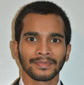

## About

Darshana Lakmal Weerawarne,  
a Post-Doctoral Fellow,  
at [Center for Advanced Microelectronics Manufacturing (CAMM)](https://www.binghamton.edu/camm/),  
of [Binghamton University](https://www.binghamton.edu/)  

## Research Interest
* Flexible Electronics; design, fabrication, and reliability testing  
* Applied Optics; develop optical systems for research in flexible electronics  
* Numerical computing  

## Research Experience 
* 2017-2019 Postdoctoral Research - Flexible Electronics  
  [Center for Advanced Microelectronics Manufacturing (CAMM), Binghamton University, USA](https://www.binghamton.edu/camm/)  
  Adviser - [Prof. Mark D Poliks](https://www.binghamton.edu/mse/profile.html?id=mpoliks)  

* 2013-2017 Doctoral Research - Nonlinear Propagation of Ultrashort Laser Pulses  
  [Femtosecond Spectroscopy and Smart Energy Laser Lab, Binghamton University, USA](https://sites.google.com/a/binghamton.edu/bshim/home)  
  Adviser - [Prof. Bonggu Shim](https://www.binghamton.edu/physics/research/profile.html?id=bshim)  

* 2010-2012 Postgraduate Research - Sustainable Computing and Smart Home Electronics  
  [Sustainable Computing Research Group, University of Colombo School of Computing](http://www.scorelab.org/)  
  Adviser - [Dr. Kasun de Zoysa](https://ucsc.cmb.ac.lk/profile/kasun/)  
  Adviser - [Dr. Chamath Keppitiyagama](https://ucsc.cmb.ac.lk/profile/cik/)  

* 2008-2010 Undergraduate Research - Lightning Induced Electric Field Detection  
  [Atmospheric and Lightning Research Group, University of Colombo, Sri Lanka](https://science.cmb.ac.lk/physics/research/research-groups/atmospheric-and-lightning-research-group/)  
  Adviser - [Prof. Mahendra K Fernando](https://science.cmb.ac.lk/physics/member/dr-i-m-k-fernando/)  

## Education 
* PhD in Physics, [State University of New York (SUNY) at Binghamton](https://www.binghamton.edu/), USA, 2017  
* MS in Physics, [State University of New York (SUNY) at Binghamton](https://www.binghamton.edu/), USA, 2014  
* BSc in Engineering Physics, [University of Colombo](https://cmb.ac.lk/), Sri Lanka, 2010  

