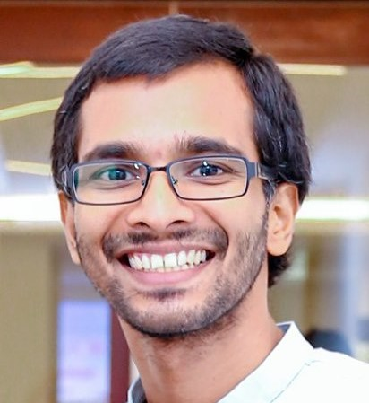

## About Me

Darshana L Weerawarne,  
a [Senior Lecturer](https://www.res.cmb.ac.lk/physics/darshana-lakmal/){:target="_blank"},  
at [The Department of Physics](https://science.cmb.ac.lk/physics/){:target="_blank"},  
of [The University of Colombo, Sri Lanka](https://cmb.ac.lk/){:target="_blank"}   

Other affiliations  
[Center for Advanced Microelectronics Manufacturing, Binghamton, USA](https://www.binghamton.edu/camm/){:target="_blank"}  

## Research Interest
* Flexible Electronics; design, fabrication, and reliability  
* Applied Optics; optical systems for research in flexible electronics  
* Numerical computing; laser assisted heating  

## Research Experience 
* 2017-2019 Postdoctoral Research - Flexible Electronics  
  [Center for Advanced Microelectronics Manufacturing, Binghamton University, USA](https://www.binghamton.edu/camm/){:target="_blank"}  

* 2013-2017 Doctoral Research - Nonlinear Propagation of Ultrashort Laser Pulses  
  [Femtosecond Spectroscopy and Smart Energy Laser Lab, Binghamton University, USA](https://sites.google.com/a/binghamton.edu/bshim/home){:target="_blank"}  

* 2010-2012 Postgraduate Research - Sustainable Computing and Smart Home Electronics  
  [Sustainable Computing Research Group, University of Colombo School of Computing](http://www.scorelab.org/){:target="_blank"}  

* 2008-2010 Undergraduate Research - Lightning Induced Electric Field Detection  
  [Atmospheric and Lightning Research Group, University of Colombo, Sri Lanka](https://science.cmb.ac.lk/physics/research/research-groups/atmospheric-and-lightning-research-group/){:target="_blank"}  

## Education 
* PhD in Physics, [State University of New York (SUNY) at Binghamton](https://www.binghamton.edu/){:target="_blank"}, USA, 2017  
* MS in Physics, [State University of New York (SUNY) at Binghamton](https://www.binghamton.edu/){:target="_blank"}, USA, 2014  
* BSc in Engineering Physics, [University of Colombo](https://cmb.ac.lk/){:target="_blank"}, Sri Lanka, 2010  

  

    <small class="block"><!--&lt;/&gt; <a href="http://github.com/heiswayi/thinkspace" title="a minimalist Jekyll theme for technical writing">Thinkspace theme</a> by <a href="http://heiswayi.github.io">Heiswayi Nrird</a>. |--><i class="fa fa-copyright"></i> 2017-{{ site.time | date: '%Y' }} {{ site.author.name }}</small>
    <a href="mailto:dinal.bing@gmail.com"><i class="fa fa-envelope" style="font-size:21px;color:#F15B3D;"></i></a>
    <a href="https://www.facebook.com/dinalHerath" target="_blank"><i class="fa fa-facebook-square" style="font-size:22px;color:#F15B3D"></i></a>
    <a href="https://github.com/dherath" target="blank"><i class="fa fa-github-square" style="font-size:22px;color:#F15B3D"></i></a>
    <a href="https://www.linkedin.com/in/jerome-dinal-herath-bba3b0148/" target="blank"><i class="fa fa-linkedin-square" style="font-size:22px;color:#F15B3D"></i></a>
    <a href="{{ "/feed.xml" | prepend: site.baseurl }}" target="_blank"><i class="fa fa-rss-square" style="font-size:22px;color:#F15B3D"></i></a>
    <a href="https://www.researchgate.net/profile/Jerome_Dinal_Herath" target="blank"> <i style="font-size:20px;color:#F15B3D;font-weight:bold;"> RG </i></a>

  

